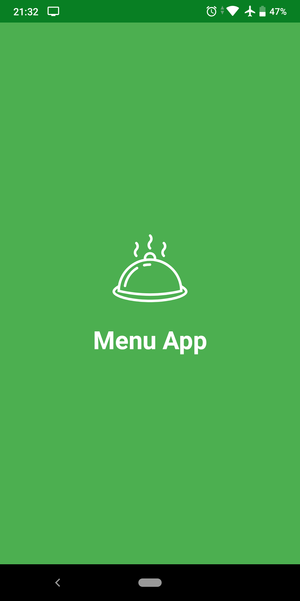
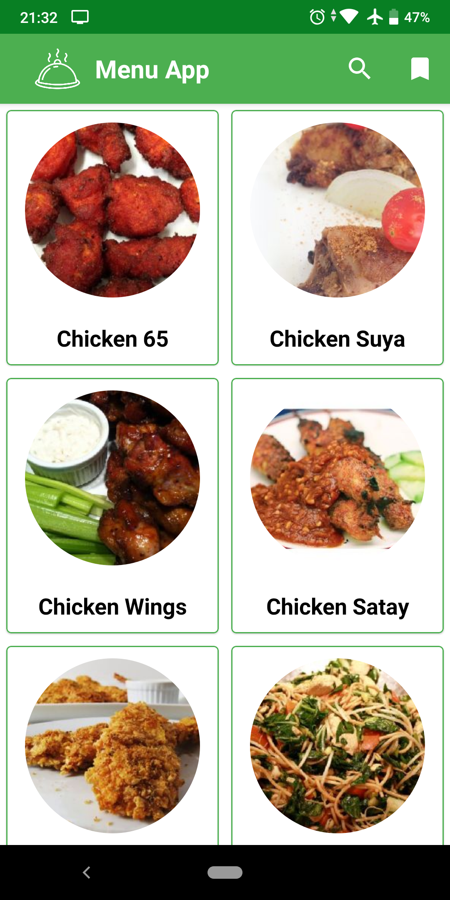
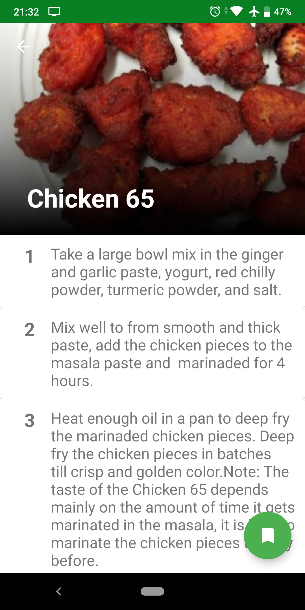
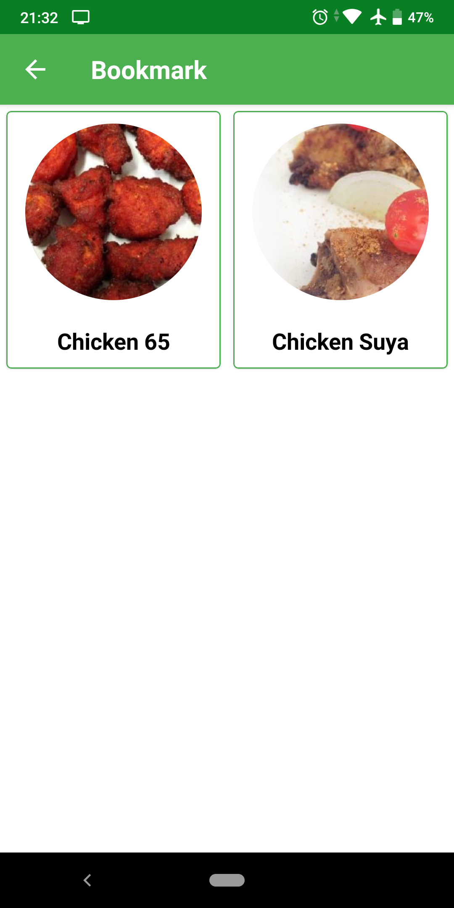

# Menu App

Aplikasi untuk memudahkan dalam mencari resep makanan. Tujuan dibuatnya aplikasi ini adalah untuk memudahkan dalam mencari resep makanan. Terlebih sebentar lagi, kita akan memasuki bulan ramadhan. Makanan menjadi faktor penting untuk mengisi kembali tenaga setelah berpuasa

## Fitur Yang Tersedia
* Mencari resep makanan
* Menampilkan setiap langkah untuk memasak
* Menyimpan resep makanan 

## Langkah menggunakan 
1. Buka Aplikasi
2. Tekan Icon Search
3. Masukkan keywoard resep yang kamu cari
4. Lalu pilih resep yang ingin kamu masak
5. Muncul setiap tahapan untuk memasak
6. Jika kamu ingin menyimpan resepnya, Tekan tombol pojok kanan bawah
7. Untuk melihat resep yang telah kamu simpan, kembali ke halaman utama
8. Tekan icon bookmark yang berada di pojok kanan atas
9. Resep yang kamu simpan, sudah muncul

## Tampilan Aplikasi

